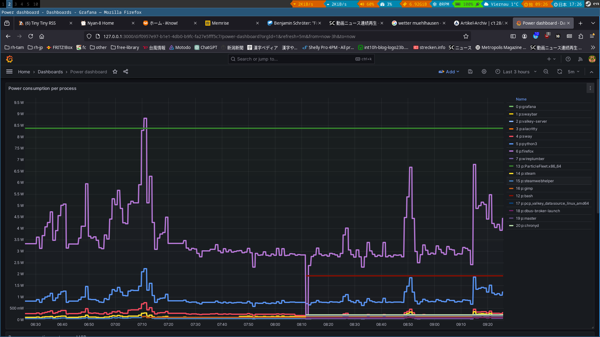

## What's here?

Code to attribute electrical power consumption of the system to
single processes.
Consumption of central components like LED-screen of a laptop is
simply getting attributed to all of the processes.  



## Design goals
* Do not employ ebpf code, so work just from userland.  This
  means we are just repeatedly looking at the process table, and
  shortlived processes can use up energy without being attributed
  by us.
* Easy to use, few dependencies

## Requirements/operation basics

* Performance Co-Pilot (PCP): this code communicates with pmcd,
  and pmda-denki to understand the overall consumption of the system.
  Works i.e. with Intel RAPL MSR provided metrics.
  pmda-linux provides details on how many userland computations the
  currently running processes did, the overall electrical consumption
  is then accordingly attributed to single processes.
* As per above, pmda-denki and pmda-linux need to be installed.
  This code is then writing the computed attribution-data into file
  /tmp/openmetrics_power from where pmda-openmetrics can read it.
* With that, the power-attribution-metrics are available in pmcd,
  and can for example be visualized.

## Installation

For example on Fedora41:
```
# (optional)
#  Install pmda-denki version which can provide Intel MSR power
#  metrics, https://github.com/performancecopilot/pcp/pull/2106

# Setup pcp with pmlogger and pmdas, i.e. in execute
dnf -y install pcp-zeroconf pcp-pmda-denki pcp-pmda-openmetrics
cd /usr/libexec/pcp/pmdas/denki && ./Install
cd /usr/libexec/pcp/pmdas/openmetrics && ./Install


# Start this code, keep it running, confirm it makes sane output
# about power consumption of the processes to the terminal:
./power.py
# Example:
The processes consumed this many userland shares: 14519400
New processes which appeared: 0
System consumption, calculated based on RAPL MSR: 5.60 W
System consumption, calculated based on power_now:: 0.00 W

+-- process consumption share from overall consumption
|	+-- process energy consumption based on bat-powernow metric
|	|	+-- process energy consumption based on RAPL MSR metric
|	|	|	   +-- process pid and command
|	|	|	   |
1 %	 0.00 W	 0.06 W	 alacritty
1 %	 0.00 W	 0.06 W	 pipewire
1 %	 0.00 W	 0.06 W	 pipewire-pulse
1 %	 0.00 W	 0.06 W	 swaybar
1 %	 0.00 W	 0.06 W	 valkey-server
2 %	 0.00 W	 0.11 W	 steamwebhelper
4 %	 0.00 W	 0.22 W	 steam
5 %	 0.00 W	 0.28 W	 sway
13 %	 0.00 W	 0.73 W	 python3
60 %	 0.00 W	 3.36 W	 firefox

# Verify file /tmp/openmetrics_power got created
ls -al /tmp/openmetrics_power

# Configure openmetrics
echo 'file:///tmp/openmetrics_power' > \
    /var/lib/pcp/pmdas/openmetrics/config.d/procpower.url
cd /var/lib/pcp/pmdas/openmetrics
./Install

# Verify the new metrics appeared
$ pminfo openmetrics.procpower
openmetrics.procpower.powerbatfull
openmetrics.procpower.powermsrfull
openmetrics.procpower.powerbat
openmetrics.procpower.powermsr

# Configure pmlogger to also capture openmetrics, # i.e. change last 
# part of /var/lib/pcp/config/pmlogger/config.default :
[..]
log advisory on 10sec {
	openmetrics
	denki
}

[access]
disallow .* : all;
disallow :* : all;
allow local:* : enquire;

# restart pmlogger
systemctl restart pmlogger
```

With that, metrics below openmetrics.procpower are usable, i.e. for
grafana visualization.

## Bugs/Future
* fetch consumption metric as float?
* if looking at gauge metric like battery-power-now, we only 
  consider the last value right now.
* we do not catch shortlived processes, living between start/end.
  Consider to check in 10sec intervals?  Will increase load caused
  by the script though.
* lookup specifics of proc.psinfo.utime source, consider to add
  kernel land load
* With Grafana visualization: even when processes are killed, they stay
  in the Grafana graph as line.  Restarting pmlogger to start a new
  archive fixes this.. but is no proper solution.
