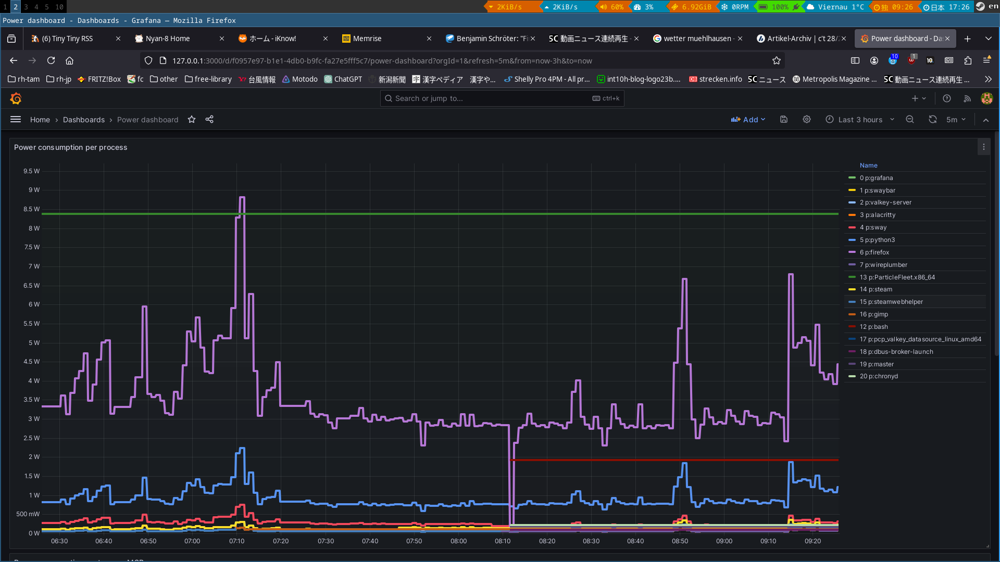
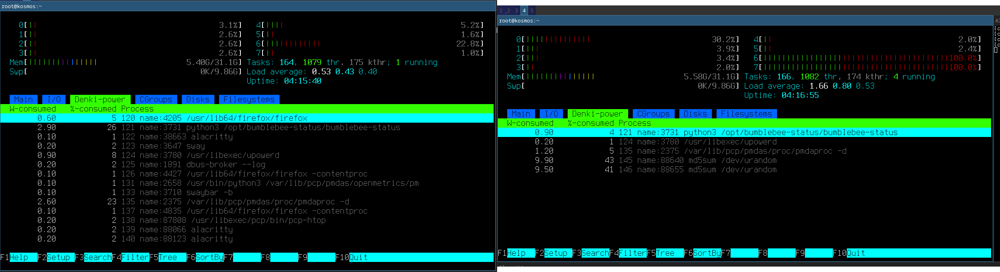

## What's here?

Code to attribute electrical power consumption of the system to
single processes.
Consumption of central components like LED-screen of a laptop is
simply getting attributed to all of the processes.  



pcp-htop is a great client to show the data:




## Requirements/operation basics

* Performance Co-Pilot (PCP): this code communicates with pmcd,
  and pmda-denki to understand the overall consumption of the system.
  Works i.e. with Intel RAPL MSR provided metrics.
  pmda-linux provides details on how many userland computations the
  currently running processes did, the overall electrical consumption
  is then accordingly attributed to single processes.
* some PMDA's are required:
  * pmda-linux, it provides data on used userland cpu cycles
  * pmda-denki, on Intel systems it will provide RAPL readings
  * pmda-lmsensors, on Apple Silicon Mac with Asahi this will
    provide power consumption metrics
  * pmda-openmetrics for getting the data back into PCP.
* With that, the power-attribution-metrics are available in pmcd,
  and can for example be visualized.


## Basic operation

We will start the denkid-daemon, it will 
* read the overall systems power consumption from i.e. pmda-denki or 
  pmda-lmsensors (i.e. on Apple silicon/Asahi linux)
* will read from pmcd how many userland computations were done by the
  processes
* will then based on the workload of the single processes assign their
  share from overall consumption, in percent and in Watt
* and will feed that data back into pmcd

When that is done, the data can be read from pmcd with clients, I'll
introduce a few.


## Installing denkid

As precondition, we will need to make overall system power consumption 
available to PCP.  That can be done for example
- in installing pmda-denki on an x86 system
- or in installing pmda-lmsensors on Asahi Linux MACs
- or with an external power meter like the power-Z, and feeding the
  overall consumption into pmcd via pmda-openmetrics

Then, install steps with exaple Fedora 43.  Below steps are to be
executed from this repo, cloned to a local directory.
```
# Setup pcp and pmdas, i.e. in execute
sudo dnf -y install pcp-zeroconf pcp-pmda-denki pcp-pmda-openmetrics \
  python3-pcp perl-PCP-PMDA pcp-devel pcp-libs-devel
cd /usr/libexec/pcp/pmdas/denki && ./Install
cd /usr/libexec/pcp/pmdas/openmetrics && ./Install

# Copy denkid into place, start it
sudo cp denkid.py /usr/local/sbin
sudo cp denkid.service /etc/systemd/system/denkid.service
sudo systemctl daemon-reload
sudo systemctl enable --now denkid
sudo systemctl status denkid

# After 30seconds, the transfer file to openmetrics should appear
ls -al /tmp/openmetrics_power.txt

# Let's then instruct openmetrics to pick that up
sudo cp openmetrics-power.url /var/lib/pcp/pmdas/openmetrics/config.d/power.url
```

With that, the metrics should become available from pmcd:

```
$ pminfo openmetrics
openmetrics.power.overall
openmetrics.power.proc.consumed
openmetrics.power.proc.consumedpercent
[..]
$ pminfo -f openmetrics.power

openmetrics.power.overall
    inst [0 or "0 name:system"] value 7.7

openmetrics.power.proc.consumed
    inst [120 or "120 name:4205 /usr/lib64/firefox/firefox"] value 0.5
    inst [121 or "121 name:3731 python3 /opt/bumblebee-status/bumblebee-status"] value 2.5
    inst [122 or "122 name:38663 alacritty"] value 0.6
    inst [123 or "123 name:3647 sway"] value 0.4
    inst [124 or "124 name:3780 /usr/libexec/upowerd"] value 0.8
    inst [125 or "125 name:1891 dbus-broker --log"] value 0.2
    inst [126 or "126 name:4427 /usr/lib64/firefox/firefox -contentproc"] value 0.2
    inst [127 or "127 name:69312 alacritty"] value 0.5

openmetrics.power.proc.consumedpercent
    inst [120 or "120 name:4205 /usr/lib64/firefox/firefox"] value 6
    inst [121 or "121 name:3731 python3 /opt/bumblebee-status/bumblebee-status"] value 33
    inst [122 or "122 name:38663 alacritty"] value 8
    inst [123 or "123 name:3647 sway"] value 5
    inst [124 or "124 name:3780 /usr/libexec/upowerd"] value 10
    inst [125 or "125 name:1891 dbus-broker --log"] value 2
    inst [126 or "126 name:4427 /usr/lib64/firefox/firefox -contentproc"] value 2
    inst [127 or "127 name:69312 alacritty"] value 6
```


## Using the denkid data

Now with the data in pmcd, let's use it!  Some options:
* **pcp-htop** is a flexible client, we can extend it to show us the current
  process/consumption ratios.  From the cloned git repo, do
  "sudo cp htop-denki /etc/pcp/htop/screens/denki".  Then ensure pcp-htop
  is installed, 'sudo dnf install pcp-system-tools' on Fedora.  You can
  then run 'pcp htop' against the live system, and should see a tab for
  process-power attribution.  If the tap does not appear, check if local
  configfiles for htop do override our customized config, i.e. do
  'find ~ | grep htop' and remove htop-conigfiles this might bring up.
* **pmlogger** is a component of PCP, and allows us to archive the new
  metrics for later evaluation with 'pmrep', with 'pcp htop' and more
  tools.
* **Grafana/valkey** can be used for visualization
* **denki-client.py** from the git repo can be used as alternative to
  pcp-htop, but can only deal with live data, not access pmlogger
  archives


## Bugs/Future

Not sure where to start.. this is merely first implementation, the bare
minimum.

- pcp-htop config does not yet sort by percent/consumption
- data transfer to pmcd should happen via direct transfer, not via
  pmda-openmetrics.  Ideally we will use metrics below the denki 
  metric for this, i.e. denki.proc.XXX.
- implement more sources for overall system consumption in denkid.py
- Design limitation: we are just in (by default 30sec) time intervalls
  looking at the processes.  If someone aims at gaming this acounting,
  they will make load just in betweek us "looking", and will stay 
  unaccounted.  Just bpf etc. would help against that, but there are
  more important features than going there, for now.
- Also covering which process is using GPU resources would be nice
- Tooling for "computation of consumed energy of processes over time".
  Right now we just measure the instant values, but we want to quantify
  how much an application consumed "over the last 3 days".  This will
  allow comparing whole applications.
- Extend into KVM guests.  The PCP in the guest needs to understand
  how much the guest itself consumes, and then attribute consumoption
  to the processes running in the guest.
